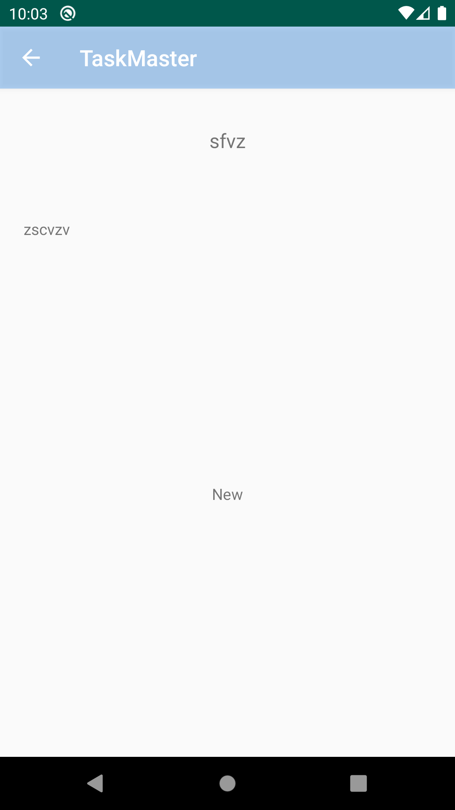

# TaskMaster

## Start TaskMaster

### 11 Feb 2020

- Created empty main activity that is the home page. The functionality of that page is two buttons. The Add Task button takes you to the AddTask Activity where you can input to fields and submit it with label of submitted become visible. The All Task button takes you tot he all task activity where you can use the back button to go back.

## Get Data TaskMaster

### 12 Feb 2020

- Created a settings page in which the user is able to set his own username which displays on the homepage. User can go to one of the three tasks to a taskDetail page to veiw the details for each unique task.

 

## RecyclerView

### 13 Feb 2020

- Created a RecyclerView to display a list of chores within the mainActivity.

## Room

### 19 Feb 2020

- Connected database to store and grab Tasks

 
